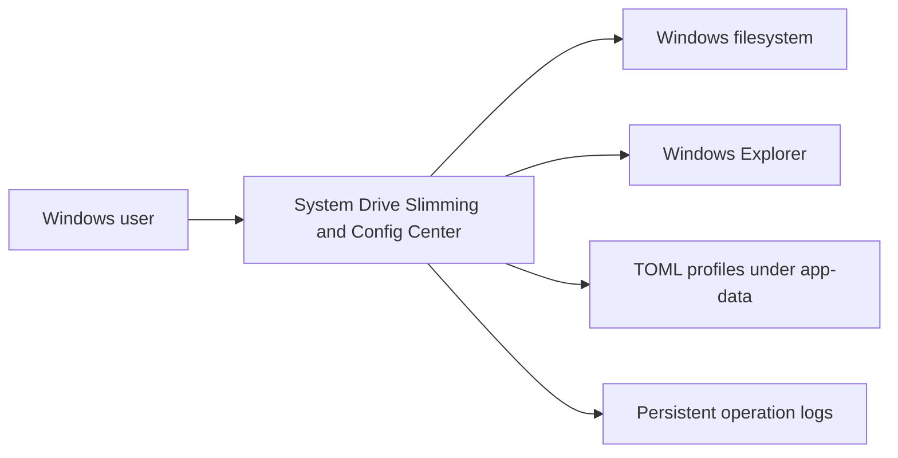
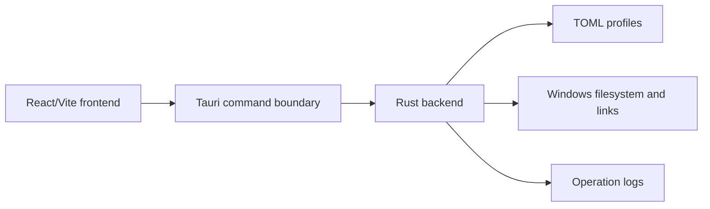
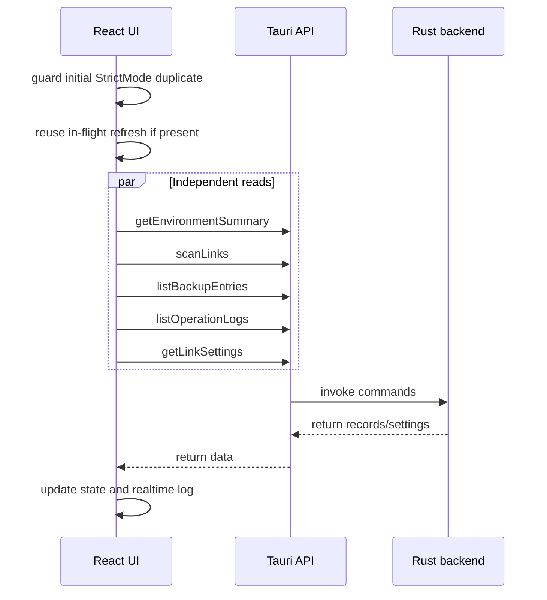

# Architecture

This file owns compact architecture context. Split architecture docs only when a topic is large, high risk, or independently maintained.

Split references:

- [Config Architecture](architecture/config.md) owns profile layout, `links.toml` schema, path rules, Windows TOML quoting, removed legacy names, and migration rules.
- [Security And Safety](architecture/security.md) owns filesystem safety, preview, confirmation, permission, and trust-boundary rules.
- [Architecture Decision Records](architecture/adr/0001-record-architecture-decisions.md) record consequential decisions.

## Architecture Overview

### Stack

- Desktop shell: Tauri 2.
- Backend: Rust Tauri commands.
- Frontend: React, TypeScript, Vite.
- Styling: Tailwind CSS and local UI primitives.
- Config format: TOML.
- Icons: `lucide-react`.
- Table/tree UI:
  - Local React tree/table components are acceptable.
  - TanStack Table is available, but not required for every table.
- Do not switch to Electron or WinUI unless the project direction changes substantially.

### Major Boundaries

- Frontend renders tables, trees, forms, dialogs, real-time logs, and invokes backend commands.
- Tauri Commands are the provided API boundary between the React frontend and Rust backend; command contracts are documented in [docs/api.md#tauri-commands-api](api.md#tauri-commands-api).
- Rust backend owns filesystem mutation, config parsing/saving, symlink detection/creation/removal, backups, scans, export generation, and persistent logs.
- TOML profiles store user-controlled configuration.

### Backend Responsibilities

Rust must own:

- config parsing and saving
- profile management
- Windows path expansion
- symlink/junction/reparse-point detection
- symlink creation/removal
- source migration
- target backup/restore/copy
- directory scans
- operation logs
- export script generation

The React frontend must not directly manipulate the filesystem except via Tauri Commands.

### Design Principles

- Backend owns filesystem work.
- Risky operations require preview or confirmation.
- Tree-building algorithms should be pure and tested.
- Config schema names should match product concepts.
- Refresh and scan are separate operations.

### Key Modules

- Frontend shell and UI: `src/App.tsx`
- Tree grouping algorithm: `src/link-tree.ts`
- Tauri API wrappers: `src/tauri-api.ts`
- Frontend types: `src/types.ts`
- Backend filesystem/config/actions: `src-tauri/src/lib.rs`

## C4 L1: System Context

The app is a local desktop tool. It does not require a server. The main trust boundary is between UI intent and backend filesystem mutation.

## C4 L2: Containers

### Containers

- React frontend: renders UI and invokes Tauri commands.
- Rust backend: owns all filesystem effects and config persistence.
- TOML profile files: store Data Repos, Mapping Roots, Free Links, backup roots, and settings.
- Windows filesystem: sources, targets, links, backups, and browsed files.

## C4 L3: Backend Commands

Backend command implementation lives in `src-tauri/src/lib.rs`.

### Command Groups

- Environment/config: `get_environment_summary`, `get_link_settings`, profile/config commands.
- Mapping actions: `scan_links`, `preview_link_actions`, `apply_link_actions`, `create_link_mapping`, `move_link_source`, `update_link_metadata`.
- Data Repo / Mapping Root / backup roots: upsert and scan commands.
- Backup browser: `list_backup_entries`, `read_text_preview`.
- Logs: `list_operation_logs`, `read_operation_log`.
- Shell integration: `open_path`, `reveal_path`.
- Export: `export_mklink_script`.

See [docs/engineering/repo-map.md](engineering/repo-map.md) for function-level search hints.

## C4 L3: Frontend Components

### Main Components

- `src/App.tsx`: app shell, tabs, dialogs, tables, forms, sidebar logs.
- `src/link-tree.ts`: pure source/target tree grouping logic.
- `src/tauri-api.ts`: Tauri command wrappers.
- `src/types.ts`: shared payload and record types.
- `src/components/ui.tsx`: small UI primitives.

### Important Frontend Behaviors

- Refresh and scan are separate operations.
- Source-specific actions should be near source paths; target-specific actions near target paths.
- Mapping tree can group by source or target.
- Free Link tree must support duplicate source paths with multiple target mappings.

## C4 L4: Core Domain Code

### Tree Grouping

Source/target grouping logic lives in `src/link-tree.ts`. It is pure TypeScript and covered by `src/link-tree.test.ts`.

Critical invariant: parent status counts and rendered leaf rows must match. A parent that says three enabled links must expand to three link leaves.

### Link Planning

Preview/apply logic lives in `src-tauri/src/lib.rs`. Risky operations should be represented as action plans before mutation.

### Config Schema

Config structs live near the top of `src-tauri/src/lib.rs`. TOML profile examples live in `app-data/default/links.toml` and `app-data/auto-test/links.toml`.

## Dynamic Flow: Refresh

Refresh means "reload according to TOML config." It is different from Scan, which checks filesystem changes under Data Repos or Mapping Roots.

## Data Model

This directory owns the app's persistent data and configuration model.

### Domain Entities

- Data Repo: a configured storage root for real files and directories.
- Mapping Root: a batch rule that maps a source folder to a target folder.
- Free Link: a one-to-one mapping whose source is outside every configured Data Repo.
- Backup/settings root: a configured root shown by the Backup Browser.
- Profile: a named config directory containing `links.toml`.

### Link Status Classification

Each scan result must classify mappings as:

- `enabled`: target is a link/reparse point and resolves to the expected source.
- `missing`: target does not exist.
- `real-content`: target exists but is not a link/reparse point.
- `wrong-target`: target link points somewhere else.
- `broken`: target link is unreadable or points to a missing path.
- `source-missing`: configured source does not exist.

### Config Architecture

Configuration is detailed in [docs/architecture/config.md](architecture/config.md). That file owns profile layout, `links.toml` schema, path rules, Windows TOML quoting, removed legacy names, and migration rules.

Other docs should link to [docs/architecture/config.md](architecture/config.md) instead of copying config facts.

### Code References

- Backend model and config parsing: `src-tauri/src/lib.rs`.
- Frontend model types: `src/types.ts`.
- Tree grouping model: `src/link-tree.ts`.
- Default profile data: `app-data/default/links.toml`.
- Auto-test profile data: `app-data/auto-test/links.toml`.

## Deployment

This desktop app has no hosted deployment topology.

Runtime layout and packaging are documented in [Setup](engineering.md#setup) and [Release](engineering.md#release). Config path rules are documented in [Config Model](architecture/config.md).

## Quality Attributes

### Performance

- Initial refresh must be guarded against React StrictMode duplicate effects.
- `refreshAll()` must deduplicate in-flight refreshes.
- Independent refresh reads should run in parallel.
- Future optimization: add a backend aggregate command such as `get_dashboard_state()`.
- Future optimization: partial refresh after mutations instead of full rescans.

### Reliability

- Operation logs should capture commands, results, errors, and backup paths.
- Tests should cover hidden filesystem/path cases such as `.espanso`.
- Auto-test profile should create and clean isolated runtime paths.

### Maintainability

- Keep domain naming consistent across UI, config, and code.
- Add regression tests for every subtle tree/grouping bug.
- Record repeated AI mistakes in [docs/ai.md#gotchas](ai.md#gotchas).

